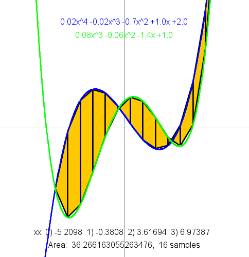

# Intro2CS_Ex1 
### ***Lior Lyubarsky - 216687863***
Ex1 - Basic programming: static functions, arrays, and JUnit.

This is assigment #1 at Ariel University, School of Computer Science, 2026.

The assigment focuses on function over arrays that represent polynomials.

For example: the array of doubles {-3, 0.61, 0.2} represent the polynomial 0.2x^2+0.61x-3

and the array {0,0,1} represents the polynomial x^2.

## ***Files***
The assigment comes with 3 related files, each has it's own purpose and Use

1. __Ex1__ -  The main class of the assigment, all the functions are written in here

2. __Ex1_GUI__ - A simple GUI class, uses [stdDraw](https://introcs.cs.princeton.edu/java/stdlib/javadoc/StdDraw.html)

3. __Ex1_Test__ - Junit testing class used for testing all the polynomial functions in Ex1

## ***Functions***

__1. f -__ computes the f(x) value of a polynomial 

__2. root_rec -__ given a polynomial as an array representation return a double representing the root of the polynomial

__3. PolynomFromPoints -__ returns an array representing a polynomial that goes through 3 or 2 given points

__4. equals -__ checks if two polynomials represent eachother

__5. poly -__ given an array that represents a polynomial the function return a string that reprsents thhe polynomial

__6. sameValue -__ computes the intersection point of two polynomials

__7. length -__ the length of a polynomial between two points

__8. area -__ computes the area between two polynomial functions within two point,
using trapezoids and [Riemann's like integral](https://en.wikipedia.org/wiki/Riemann_integral)

__9. getPolynomFromString -__ given a string that represents a polynomial return an array that represents the same polynomial

__10. add -__ computes the polynomial which is the sum of two polynomials

__11. mul -__ omputes the polynomial which is the multipication of two polynomials

__12. derivative -__ computes the derivative of a polynomial fucntion

## ***Result***
This is the gui after all the functions have been written and completed

